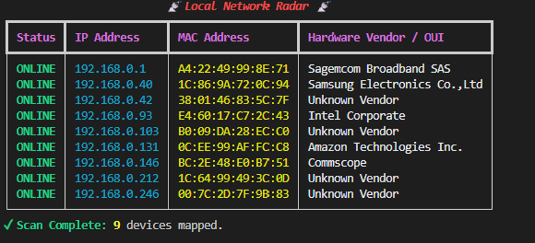

# 📡 Local Network Reconnaissance Suite

A modular Python toolkit for local subnet reconnaissance, asset mapping, and service enumeration.

---

## 1. Local Network Radar (`radar.py`)

A lightweight Layer 2 network reconnaissance tool that maps active devices across a local subnet using Address Resolution Protocol (ARP) broadcasting and resolves hardware manufacturers via IEEE OUI queries.

### Key Technical Features
* **Layer 2 Host Discovery:** Broadcasts raw Ethernet frames (`ff:ff:ff:ff:ff:ff`) to force replies from hosts that drop standard ICMP ping packets.
* **OUI Vendor Resolution:** Extracts the first 3 bytes of detected MAC addresses to dynamically query the MAC Vendors API.
* **In-Memory Caching:** Implements an internal lookup cache (`VENDOR_CACHE`) to eliminate redundant HTTP requests for identical hardware vendors.
* **Telemetry Dashboard:** Formats discovered hosts into an IP-sorted terminal interface using `rich`.

### Proof of Concept


### Technical Deep Dive
* **Layer 2 (ARP) vs. Layer 3 (ICMP):** Standard network discovery often relies on ICMP Echo Requests (pings). Modern host firewalls silently drop ICMP traffic, making hosts appear offline. Because devices in a broadcast domain must resolve IP addresses to physical MAC addresses to communicate, hosts cannot ignore Layer 2 ARP requests without losing connectivity.
* **MAC Address Randomization:** Modern mobile platforms (iOS, Android 10+) employ MAC address randomization for privacy, setting the locally administered bit to `1` (identifiable by `x2:`, `x6:`, `xA:`, or `xE:` prefixes). These randomized frames discard the vendor OUI and return as unknown.

---

## 2. Multi-Threaded Service Banner Grabber (`grabber.py`)

A concurrent TCP socket scanner designed to audit listening services and extract Application Layer (Layer 7) banners across discovered local assets.

### Key Technical Features
* **Threaded Concurrency:** Leverages Python’s `concurrent.futures.ThreadPoolExecutor` to probe target ports simultaneously, eliminating connection timeout latency.
* **Protocol Probing:** Automatically issues `HEAD / HTTP/1.1` probes against web-associated ports to parse HTTP `Server:` response headers.
* **Banner Extraction:** Captures service identification strings from standard administrative daemons (e.g., `lighttpd`, OpenSSH).

### Key Security Findings & Observations
* **Router Management (`192.168.0.1`):** Exposed an administrative HTTP daemon on Port 80, resolving the banner `lighttpd/1.4.67`. This identifies the exact software version running the gateway for targeted CVE research.
* **The TLS Barrier (Port 443):** The TCP 3-way handshake succeeded on port 443 (reported as `OPEN`), but returned no banner because the TLS listener expects an encrypted `ClientHello` handshake rather than a plaintext HTTP probe.
* **Consumer IoT Attack Surface:** Scanning consumer IoT targets (smart plugs, media streaming devices) returned no open common management ports. This demonstrates the modern IoT security architecture: disabling local listening services in favor of persistent, outbound cloud-polled tunnels (MQTT/HTTPS) to mitigate local network exploitation.

---

## 🚀 Installation & Usage

### Requirements
* Python 3.10+
* Npcap (Windows) or Libpcap (Linux/macOS)
* `scapy>=2.5.0`
* `rich>=13.0.0`
* `requests>=2.31.0`

### Setup
```powershell
# Clone the repository
git clone https://github.com/clang2619/local-network-radar.git
cd local-network-radar

# Install dependencies
py -m pip install -r requirements.txt
```

### Running the Tools
```powershell
# 1. Run Layer 2 Host Discovery (Requires Administrator / elevated terminal)
py radar.py

# 2. Run Service Audit on a specific target
py grabber.py 192.168.0.1
```